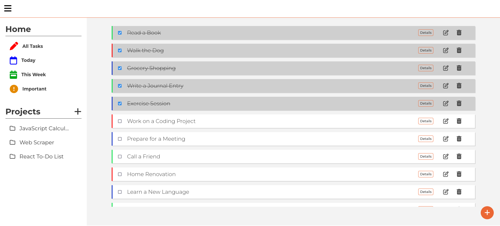

# Task Tracker

Keeping track of your tasks just like you want to.

- Save Tasks to one directory
- Filters your current task, for the week's tasks, and the important ones.
- Create task with its priorities
- Organize your projects in different folders

[Live Demo](https://heyitslauu.github.io/task-tracker/) |
[Git Repo](https://github.com/heyitslauu/task-tracker)

