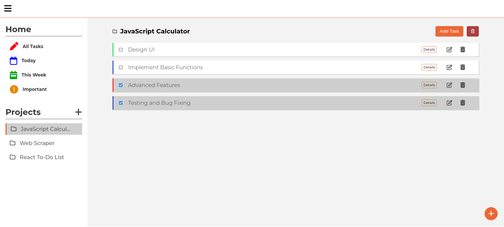

# Task Tracker
The staple projects for every aspiring developer, The Todo List application.

Task Tracker keeps track of your tasks just like you want to. It also: 
- Save Tasks to one directory
- Filters your current task, for the week's tasks, and the important ones.
- Create task with its priorities
- Organize your projects in different folders/projects
- And also save things at your browser's local storage

[Live Demo](https://heyitslauu.github.io/task-tracker/) |
[Git Repo](https://github.com/heyitslauu/task-tracker)

### **Key Takeaways**
- Classes and Constructors
- Array methods
- Closures
- Local Storage
